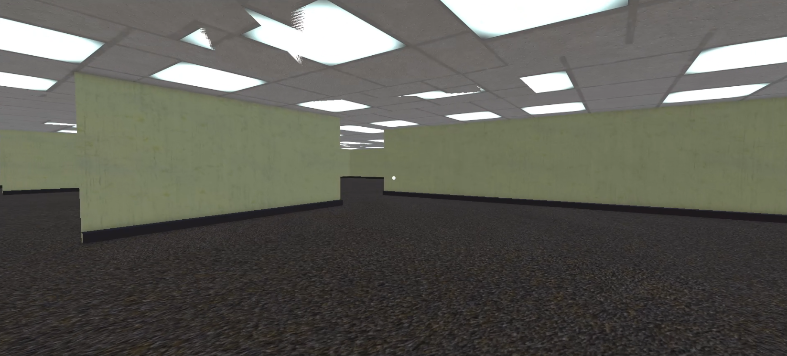

# Oyun Geliştrme Bootcamp Grup 39

Bu depo, Unity tabanlı oyun geliştirme bootcamp'inin 39. grubu için hazırlanmıştır. Aşağıda proje hakkında genel bilgileri ve çalışma talimatlarını bulabilirsiniz.

## İçindekiler

- [Takım Üyeleri](#takım-üyeleri)
- [Oyun Açıklaması](#oyun-açıklaması)
- [Oyun Hikayesi](#oyun-hikayesi)
- [Oyun Özellikleri](#oyun-özellikleri)
- [Sprint 1](#sprint-1)
- [Sprint 2](#sprint-2)
- [Sprint 3](#sprint-3)

## Takım Üyeleri

| İsim           | Rol           |
| -------------- | ------------- |
| Sena Nur Ünal  | Product Owner |
| Emrullah Alku  | Scrum Master  |
| Furkan Beşirli | Developer     |
| Yavuz Avcı     | Developer     |
| İpek Demirel   | Developer     |

## Oyun Açıklaması

Zihin Odası, tek oyunculu, psikolojik bir keşif oyunudur. Oyuncu, gerçekliğin dışında bir bilinç alanında uyanır ve parçalanmış bir zihnin içinde, duygusal olarak yüklü beş farklı odayı keşfetmeye başlar. Her oda bir duyguyu temsil eder ve oyuncu, geçmişin izleriyle yüzleşerek ilerler. Bu yolculuk sonunda oyuncunun vereceği karar, karakterin kaderini belirleyecek kadar güçlüdür.

## Oyun Hikayesi

Derin bir sessizlik içinde gözlerini açan bir genç... Nerede olduğu belirsiz, etrafındaki dünya ise tanıdık ama bozulmuş. Sessiz odalar, eksik anılar ve yüzleşilmeyi bekleyen duygular… Oyuncu, bu bilinç alanında yol aldıkça; öfke, korku, üzüntü, mutluluk ve umutla yüzleşir. Her odada yeni bir parça açığa çıkar, her adım karakterin kimliğini ve geçmişini biraz daha anlamlandırır. Ancak bu yolculuk yalnızca keşif değil, aynı zamanda bir seçimdir: devam etmek ya da sonsuza dek durmak.

## Hedef Kitle

- Psikolojik temalı hikaye tabanlı oyunlara ilgi duyanlar
- Duygusal derinliği olan deneyimler arayan yetişkin ve genç oyuncular
- Life is Strange, What Remains of Edith Finch, Omori gibi oyunlardan hoşlananlar
- Kısa ama anlamlı deneyimler sunan bağımsız yapımları sevenler

## Oyun Özellikleri

- 3D
- Tek Oyunculu
- Derik Hikaye Örgüsü

# Sprint 1

- **Sprint Notları**: [Sprind Board](https://emrullahalku.atlassian.net/jira/software/projects/OGG3/boards/35?atlOrigin=eyJpIjoiYWQyMGZjZDhkYzc0NDE5NGExMGEzZDAxOWM4MGRmZWYiLCJwIjoiaiJ9)
- **Sprint içinde tamamlanması tahmin edilen puan**: 50
- **Puan tamamlama mantığı**: Proje boyunca tamamlanması gereken toplam 400 puanlık backlog bulunmaktadır. 3 sprinte bölündüğünde ilk sprintin 50 ile başlaması gerektiği kararlaştırıldı.
- **Daily Scrum**: Daily Scrum toplantılarının Meets ve Slack üzerinden yapıldı. Daily Scrum toplantılarımız ve günlük Whatsapp konuşmalarımız [Imgur](https://imgur.com/a/shcnWhl)'da toplanmıştır
- **Sprint board update**: Sprint board screenshot: 

<strong>Oyun içi Screenshotlar</strong>

- **Sprint Review**:
  - Bütün ekip projede hangi kısımların bittiğini ve bunun hakkındaki görüşlerini iletti. Oyunun güncel gidişatının yavaş kalındığı dile getirildi. Onun dışında herhangi bir sorun ile karşılaşılmadı.
- **Sprint Retrospective**:

  - **İyi Gidenler**
    - Ekip içi iletişim kuvvetliydi.
    - Toplantılar zamanında yapıldı
  - **Geliştirilmesi Gerekenler**
    - Zaman yönetimi daha sıkı tutulmalı.
    - Karar aşamaları daha hızlı halledilmeli.
  - **Eylem Maddeleri**

    - Bir sonraki sprint'te, projenin somut adımlarına daha çok odaklanılacak.

    # Sprint 2

- **Sprint Notları**: [Sprind Board](https://emrullahalku.atlassian.net/jira/software/projects/OGG3/boards/35?atlOrigin=eyJpIjoiYWQyMGZjZDhkYzc0NDE5NGExMGEzZDAxOWM4MGRmZWYiLCJwIjoiaiJ9)
- **Sprint içinde tamamlanması tahmin edilen puan**: 150
- **Puan tamamlama mantığı**: Proje boyunca tamamlanması gereken toplam 400 puanlık backlog bulunmaktadır. 2. sprint için bu puan 150 olarak kararlaştırılmıştır.
- **Daily Scrum**: Daily Scrum toplantılarının Meets ve Slack üzerinden yapıldı. Daily Scrum toplantılarımız ve günlük Whatsapp konuşmalarımız [Imgur](https://imgur.com/a/WVFNq4R)'da toplanmıştır
- **Sprint board update**: Sprint board screenshot: 

<strong>Oyun içi Screenshotlar</strong>

- **Sprint Review**:
  - Bütün ekip projede hangi kısımların bittiğini ve bunun hakkındaki görüşlerini iletti. Oyunun güncel gidişatının hala yavaş kalındığı dile getirildi. Yeteri kadar toplantı yapılmadı ve iletişim zayıf kaldı. Onun dışında herhangi bir sorun ile karşılaşılmadı.
- **Sprint Retrospective**:
  - **Geliştirilmesi Gerekenler**
    - Zaman yönetimi daha sıkı tutulmalı.
    - Daha fazla toplantı yapılmalı
  - **Eylem Maddeleri**
    - Bir sonraki sprint'te, projenin somut adımlarına daha çok odaklanılacak.
    - Toplantı sıklığı arttıralacak

# Sprint 3

- **Sprint Notları**: [Sprind Board](https://emrullahalku.atlassian.net/jira/software/projects/OGG3/boards/35?atlOrigin=eyJpIjoiYWQyMGZjZDhkYzc0NDE5NGExMGEzZDAxOWM4MGRmZWYiLCJwIjoiaiJ9)
- **Sprint içinde tamamlanması tahmin edilen puan**: 285
- **Puan tamamlama mantığı**: Proje boyunca tamamlanması gereken toplam 400 puanlık backlog bulunmaktadır. 3. sprint için bu puan 285 olarak kararlaştırılmıştır.
- **Daily Scrum**: Daily Scrum toplantılarının Slack üzerinden yapıldı. Daily Scrum toplantılarımız ve günlük Whatsapp konuşmalarımız [Imgur](https://imgur.com/a/1lIqOGw)'da toplanmıştır.
- **Sprint board update**: Sprint board screenshot: 

<strong>Oyun içi Screenshotlar</strong>

- **Sprint Review**:
  - Bütün ekip projede hangi kısımların bittiğini ve bunun hakkındaki görüşlerini iletti. Oyunun ilk 2 sprintinde gidişat yavaş olduğundan bu haftaya çok yük bindi. Onun dışında herhangi bir sorun ile karşılaşılmadı.
- **Sprint Retrospective**:
